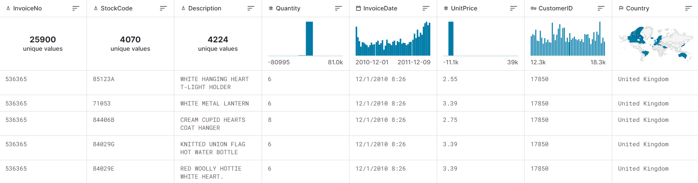

# Document Stream Pipeline

## 01-workflow snapshot


## 02-Ecommerce data
The E-commerce dataset used in this project is taken from the source: [ecommerce-data](https://www.kaggle.com/datasets/carrie1/ecommerce-data) and this dataset comes with the following attributes and the sample headshot is given here:



The above data has got some transformations regarding the data formats.

## 03-api Ingest
* Fastapi application is built for the data ingesting into the applications using a basemodel and post item into the **kafka buffer**.<br>
    * If the informations is in correct format **200 resonse** is returned.
    * Else the **400 Error resposne** is resulted to the user.

* Containerize the application with image name as api-ingest from the current directory in cli using the code snippet follows:
```
docker build -t api-ingest .
```
The sample shot of the posting values to the application is here:


## 04-Kafka buffer
* create two kafka topics for listening api-ingested data and the spark output topic for the spark data processing.you can create topic with following kafka snippet:
```
./kafka-topics.sh --create --topic ingestion-topic --bootstrap-server localhost:9092

./kafka-topics.sh --create --topic spark-output --bootstrap-server localhost:9092
```
* List out the all topics in kafka buffer:
```
./kafka-topics.sh --list --bootstrap-server localhost:9092
```
* Open a listener for the spark output to listen the data coming from the api-ingest.
```
./kafka-console-consumer.sh --topic spark-output --bootstrap-server localhost:9092
```
The sample shot for the kafka listening to topic and producing the result console is here:


## 05-Spark processing
* create a spark context, session with the following:<br>
    * Add packages kafka, mongodb for data storing, spark sql for the data processing.
    * Connect to the mongodb with the username and password.
* Read the message from the kafka stream and note that we have to unpack the binaries of keys and values in kafka storage.
* Create a temporary view of the kafka stream and process it by using a data frame and store it in the mongodb using the spark mongodb connector.


* Above writing it into the mongodb is done with the batch wise processing of the data, batches may have vary number of records into the spark and storing it into the mongodb.


## 06-MongoDB store
* The processed data from the spark output context is gets stored into the mongodb using the **spark-mongodb connector**.


* The all data in the MongoDB is stored with the **key-values** pair indexes, and snapshot of this documents is here:


## 07-Streamlit analysis
* The all processed data is now stored into the mongodb store and using the pymongo connector and streamlit UI dashboards are built.
* The sample dashboard of some visuals are given here with attributes:
    * Invoice No
    * Customer ID<br>
    Input:<br>
      
    Dashboard:<br>
    
